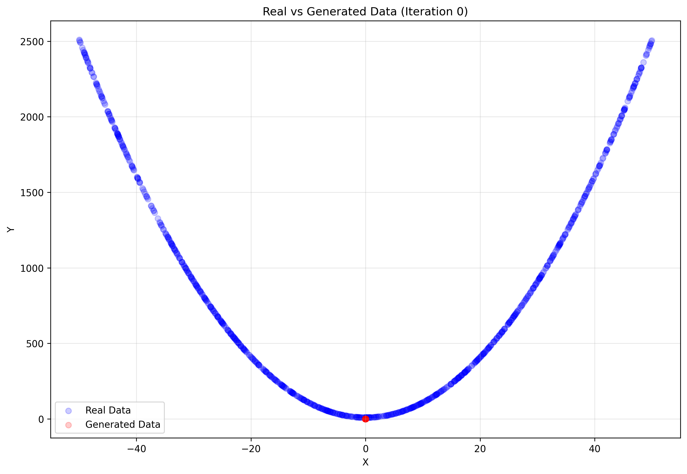
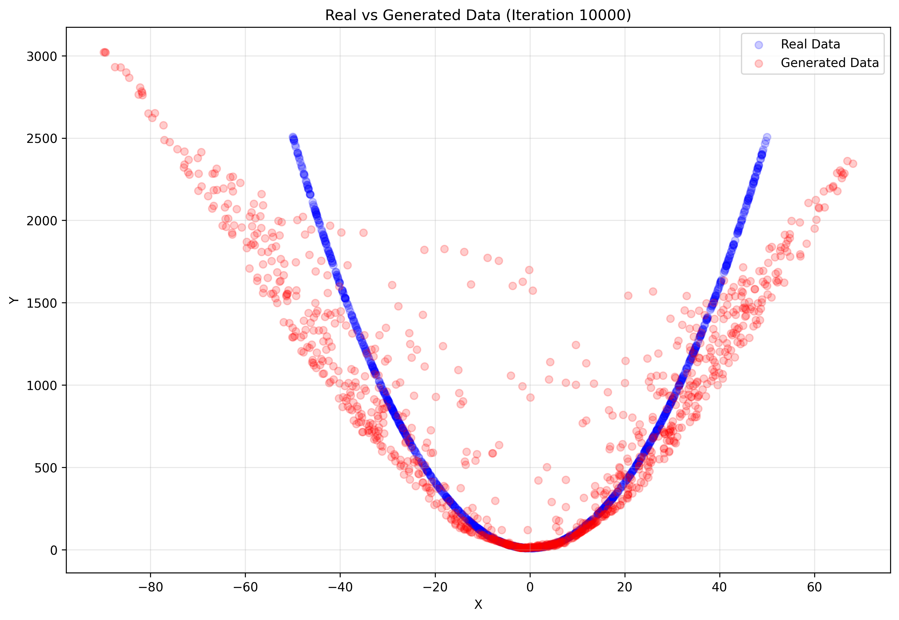
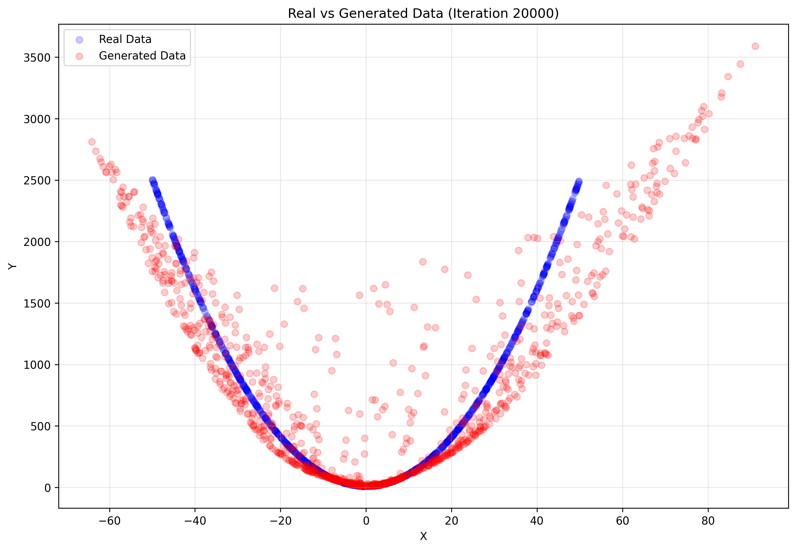
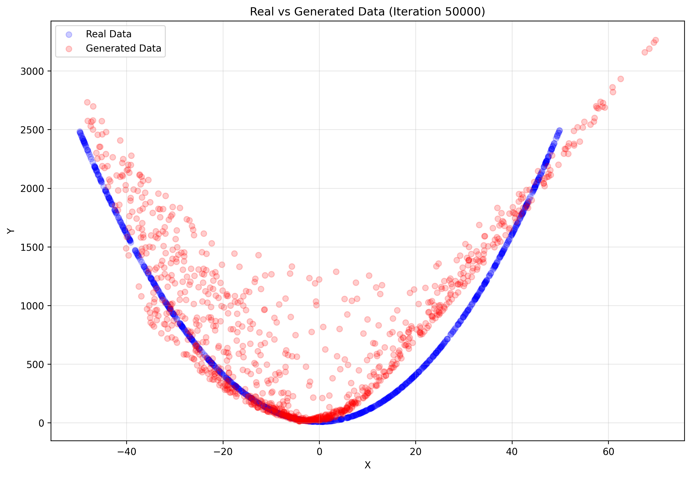
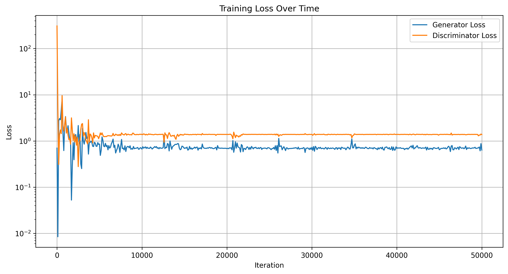

# GAN-python

# Learning Quadratic Functions with GANs

## Overview
This project documents my first implementation of a Generative Adversarial Network (GAN), designed to learn and generate points following a quadratic distribution (y = 10 + x²). Through this journey, I've learned not only about GANs but also about the challenges and intricacies of training generative models.

## Results and Training Progress

### Training Evolution
Below is the progression of the GAN learning to generate points following the quadratic function:

#### Initial Stage (Iteration 0)

*At the start, the generator produces random points with no clear pattern.*

#### Early Progress (Iteration 10000)

*The generator begins to understand the general shape of the quadratic function.*

#### Mid Training (Iteration 20000)

*The distribution starts to align more closely with the true quadratic function.*

#### Final Result (Iteration 50000)

*The generator successfully produces points following the quadratic pattern.*

### Training Loss

*The graph shows the convergence of generator and discriminator losses over time.*

## Technical Implementation

### Architecture
```python
# Generator Architecture
class Generator(Model):
    def __init__(self):
        super(Generator, self).__init__()
        self.layer1 = layers.Dense(128, activation='leaky_relu')
        self.layer2 = layers.Dense(128, activation='leaky_relu')
        self.output_layer = layers.Dense(2)

# Discriminator Architecture
class Discriminator(Model):
    def __init__(self):
        super(Discriminator, self).__init__()
        self.layer1 = layers.Dense(128, activation='leaky_relu')
        self.layer2 = layers.Dense(128, activation='leaky_relu')
        self.feature_layer = layers.Dense(2)
        self.output_layer = layers.Dense(1)
```

### Key Training Parameters
- Batch Size: 256
- Learning Rate: 0.001
- Training Iterations: 50,000
- Optimizer: Adam
- Loss Function: Binary Cross-entropy

## Analysis of Results

### What Worked Well
1. **Progressive Learning**: As seen in the progression plots, the GAN steadily improved its understanding of the quadratic function.
2. **Stability**: The loss history shows relatively stable training without major oscillations.
3. **Final Accuracy**: The generated points closely follow the true quadratic distribution.

### Challenges Faced
1. Initial setup of the proper loss functions
2. Balancing generator and discriminator training
3. Choosing appropriate network architectures
4. Determining the right frequency for visualization

## Future Improvements

### Short-term Enhancements
1. **Architecture Optimization**
   - Add batch normalization
   - Experiment with deeper networks
   - Try different activation functions

2. **Training Improvements**
   - Implement learning rate scheduling
   - Add early stopping
   - Experiment with different optimizers

### Long-term Goals
1. **Extended Functionality**
   ```python
   # Example of planned conditional GAN implementation
   class ConditionalGenerator(Model):
       def __init__(self):
           # Future implementation for generating multiple function types
           pass
   ```

2. **Interactive Components**
   - Real-time training visualization
   - Web interface for parameter tuning
   - Function type selection

## Running the Project

### Prerequisites
```bash
pip install tensorflow numpy matplotlib
```

### Execution
```bash
python gan_quadratic.py
```

The code will create a timestamped directory (e.g., `gan_plots_20241125_121500/`) containing:
- Progress plots every 10,000 iterations
- Loss history visualization
- Saved model weights

## Repository Structure
```
.
├── gan_quadratic.py              # Main GAN implementation
├── README.md                     # This documentation
└── gan_plots_[timestamp]/        # Generated results
    ├── gan_plot_iteration_*.png  # Training progress plots
    ├── loss_history.png         # Training loss visualization
    └── final_model/             # Saved models
```

## Lessons Learned
1. The importance of proper visualization in understanding GAN behavior
2. The critical role of hyperparameter tuning
3. The value of tracking and saving training progress
4. The balance between generator and discriminator training

## Contributing
This is my first GAN project, and I welcome suggestions and improvements! Feel free to:
1. Open issues for questions or problems
2. Submit pull requests with improvements
3. Share ideas for future enhancements

## Acknowledgments
- TensorFlow and Keras documentation
- GAN paper by Ian Goodfellow et al.
- Online deep learning community

## License
MIT License - Feel free to use and learn from this code!

---
*This project represents my journey into the world of GANs. The visual results show the progression from random noise to a well-defined quadratic distribution, demonstrating the power of generative models even in simple mathematical applications.*